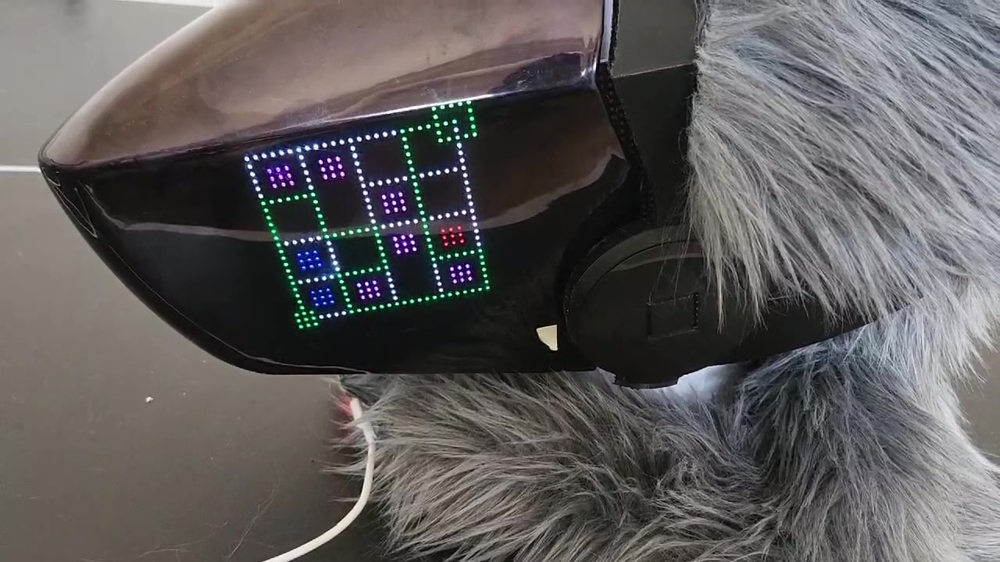

# REFERENCE DOCUMENT - CONTAINS SPOILERS!!!!

---

# 0. NOTATION

- Puzzle dimensions are in terms of grid cells. So a 3x3 puzzle has 4 vertical lines and 4 horizontal lines, with 9 grid cells inside.

# I. THE WITNESS

- The Witness contains 523 campaign puzzles (i.e. panel-based) split across 17 zones.
- 11 of the zones contain lasers that can be activated and pointed to the mountain. One laser does not initially go that way, and must be rotated somewhere else.
- Among the 523 panels are 6 vault access puzzles (that correspond to 6 videos in the theater) and 14 discarded panels.
- There are also 135 environmental puzzles (puzzle shapes that appear in the environment but are nevertheless traceable) which are partitioned into six regions.

# II. THE CHALLENGE

In this section, all singular numbers are 100% known. All interval values are approximate and might not be 100% accurate.

The structure of the challenge is largely as follows:
- One 3x3 panel with 5-10 cuts.
- One 7x7 panel with 40-50 cuts.
- One 4x4 panel with 4-8 cuts and 4-8 blobs in 2 colors.
- One 5x5 panel with 15-20 cuts and 2 dots.
- One 7x7 panel with 30-50 cuts.
- One 4x4 panel with 4-10 cuts and 2 polynominos and 2 stars of a different color.
- One 4x4 panel with 4-10 cuts and 4 stars (same color) and 4 dots.
- One 6x6 panel with 4-10 cuts and 6 dots: 2 blue, 2 yellow, 2 black. This panel also has rotational symmetry.
- Two 4x4 panels: one with 12 blobs in 2 colors and one with 9 blobs in 3 colors.
- Two 4x4 panels with 4-10 triangles.
- One pillar with a random form of symmetry and 6 blobs in 2 colors: 3 of each color.
- One pillar with a random form of symmetry and up to 12-15 dots.
